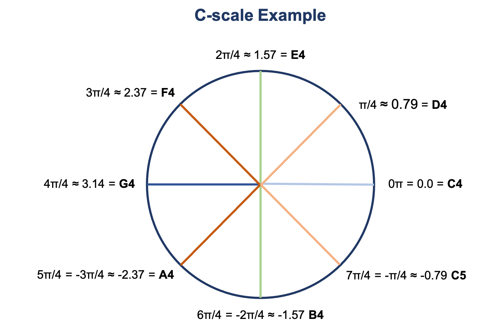

# Audio

## Files
* `play-notes.ipynb`: a simple example on how to play a note in a notebook (from [Ann-Marie's post](https://ibm-quantumcomputing.slack.com/archives/C01QKGCF17C/p1619716259010600))
* `notes-from-circuit.ipynb`: splits a circuit by column and plays the notes of each state vector
    * Splits the unit circle into eight parts (each part with angle `pi/4`) and assigns a note (pitch) by rounding to the nearest multiple of `pi/4`
    

## Useful Links

### Python
* [librosa](https://github.com/librosa/librosa)
* [pygame Mixer component](https://www.pygame.org/docs/ref/mixer.html)
* [Audio and Digital Signal Processing (DSP) in Python](https://www.pythonforengineers.com/audio-and-digital-signal-processingdsp-in-python/)

#### Jupyter Notebooks
* [Creating a sound synthesizer in a notebook](https://ipython-books.github.io/117-creating-a-sound-synthesizer-in-the-notebook/)
* [Jupyter Audio basics](https://musicinformationretrieval.com/ipython_audio.html)
* [Making music in a Jupyter notebook](https://github.com/changhiskhan/notebooks/blob/master/making_music.ipynb)

### Music/Sound
* [How does sound work](https://web.stanford.edu/class/cs101/analog-digital-1.html): on frequency, amplitude, timbre, ...
* [Frequencies of music notes](https://pages.mtu.edu/~suits/notefreqs.html#:~:text=Frequencies%20of%20Musical%20Notes%2C%20A4%20%3D%20440%20Hz)
    * `A4 = 440 Hz`
